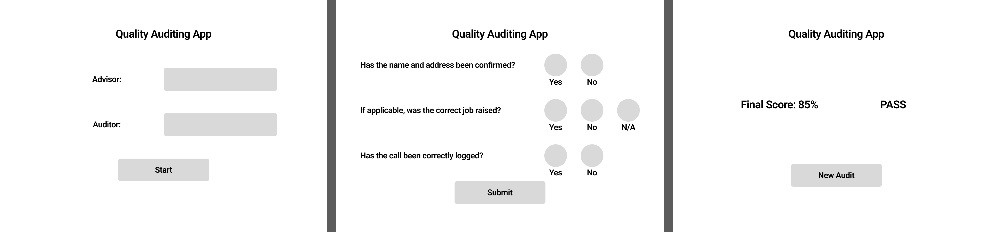
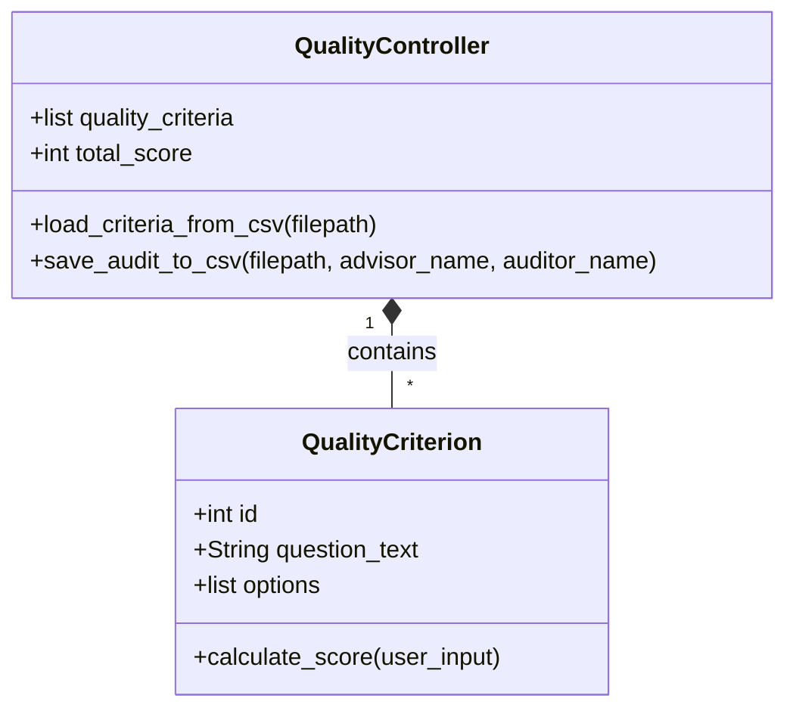

# Quality-Auditing-App
## Introduction
Working in Operations Performance, we are responsible for supporting the operational customer service teams. An upcoming project involves helping the team of quality advisors in the process of reviewing customer calls. Currently, they carry out strict auditing using spreadsheets, which are then sent to our team to be manually added to our dashboards. This current system is inefficient and prone to errors because it relies on users adhering to structured processes and validation rules. There are also issues with fragmented storage; quality advisors are required to send the spreadsheets to the Performance team for monitoring, as well as holding onto copies for further auditing.

To resolve this, the team is aiming to transition to a centralised data collection solution, such as deploying a customised [Google Form](https://ipv4.google.com/forms/about/?hl=en) or an [AppSheet](https://about.appsheet.com/home/) application. The operational goal is to establish a standardised process for quality checks that sends data to a single location directly integrated with existing dashboards. This would enable automated, real-time performance analytics and more secure data handling.

This project will look at how a similar system could be set up using a [Python](https://docs.python.org/3/)-based application. By developing a functional prototype using [Streamlit](https://docs.streamlit.io/), this project models the core mechanics required for a real-world solution. It demonstrates how to transition away from unstructured spreadsheets by employing an intuitive Graphical User Interface (GUI) that enforces input validation and ensures consistent data formatting. The application captures the audit criteria programmatically and writes the outcomes to persistent [CSV](https://docs.python.org/3/library/csv.html) storage. While the final production tool may utilise a low-code platform like AppSheet, building this Python program proves the underlying logic of the proposed workflow. It highlights how structuring data at the point of entry is crucial to advance our existing dashboards and analytics for our customer service teams.
## Design
### GUI Design
**Figure 1** shows the wireframes used during the early design stage of the application. The wireframes represent the intended user journey through the quality audit: the user inputs credentials on the Setup screen, proceeds to the Audit form to score the criteria, and clicks Submit to view the calculated Final Score and save the data. They can then continue with a new audit taking them back to the Setup screen.

**Figure 1:** Application Wireframe
### Functional Requirements
| ID  | Requirement |
|-----|-------------|
| FR1 | The application must load and display quality audit criteria from a persistent CSV file. |
| FR2 | The system must provide a GUI facilitating the input, viewing, and exporting of quality data. |
| FR3 | A final quality score will be calculated and returned based on the user's inputs. |
| FR4 | The resulting quality audit must be exported and appended to a separate permanent CSV log file. |
### Non-Functional Requirements
| ID   | Requirement |
|------|-------------|
| NFR1 | The code will be implemented using Object-Oriented Programming (OOP) principles. |
| NFR2 | The application will include robust exception handling and input validation to prevent crashes from empty or invalid submissions. |
| NFR3 | The codebase must include comprehensive documentation, utilising descriptive docstrings for all classes and functions. |
### Tech Stack Outline
* [Python 3](https://docs.python.org/3/) — Core programming language.
* [Streamlit](https://docs.streamlit.io/) — Web-based Graphical User Interface (GUI) framework chosen for rapid deployment of data-entry forms.
* [csv](https://docs.python.org/3/library/csv.html) — Local, persistent data storage for reading criteria and logging audit results.
* [pytest](https://docs.pytest.org/en/stable/) — Framework for automated unit testing.
### Code Design Document

