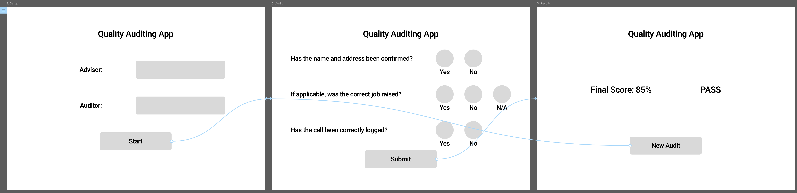
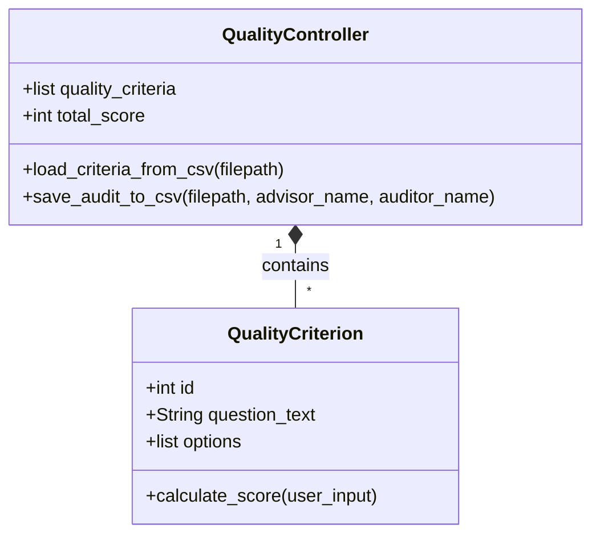
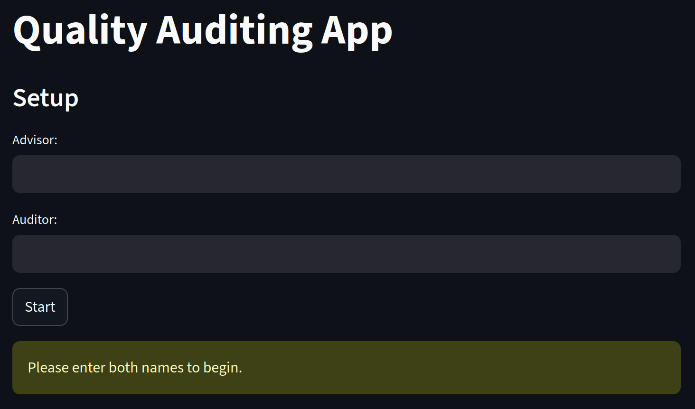
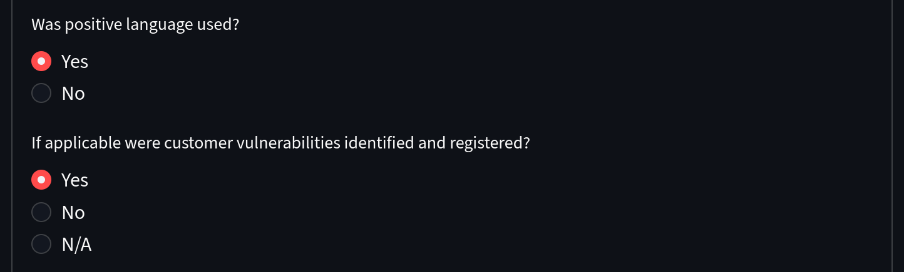
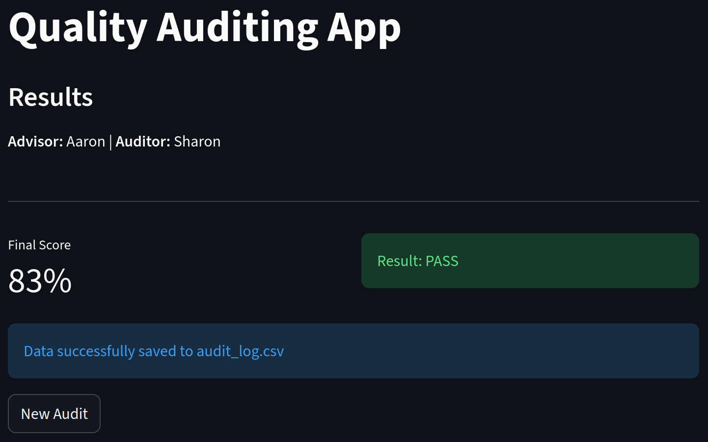
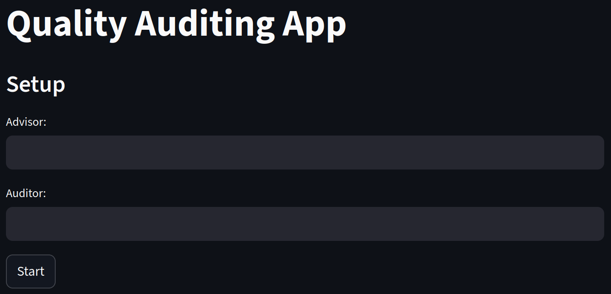

# Quality-Auditing-App

## Introduction

The Operations Performance Team is responsible for supporting operational customer services. An upcoming project involves helping the team of quality advisors in the process of reviewing customer calls. Currently, they carry out strict auditing using spreadsheets, which are then sent back to be manually added to dashboards. This current system is inefficient and prone to errors because it relies on users adhering to structured processes and validation rules. There are also issues with fragmented storage as spreadsheets are stored in multiple locations for further auditing.

To resolve this, the team is aiming to transition to a centralised data collection solution, such as deploying a customised [Google Form](https://ipv4.google.com/forms/about/?hl=en) or an [AppSheet](https://about.appsheet.com/home/) application. The operational goal is to establish a standardised process for quality checks that sends data to a single location directly integrated with existing dashboards. This would enable automated, real-time performance analytics and more secure data handling.

This project will look at how a similar system could be set up using a [Python](https://docs.python.org/3/)-based application. [Streamlit](https://docs.streamlit.io/) was specifically chosen for this prototype because it facilitates the rapid creation of web-based applications, closely mirroring the browser-based environment of the intended final solution, such as AppSheet. By developing this functional prototype, the project models the core mechanics required for a real-world solution. It demonstrates how to transition away from unstructured spreadsheets by employing an intuitive Graphical User Interface (GUI) that enforces input validation and ensures consistent data formatting. The application captures the audit criteria programmatically and writes the outcomes to persistent [CSV](https://docs.python.org/3/library/csv.html) storage. While the final production tool may utilise a low-code platform like AppSheet, building this Python program proves the underlying logic of the proposed workflow. It highlights how structuring data at the point of entry is crucial to advance existing dashboards and analytics for the customer service teams.

## Design

### GUI Design

**Figure 1** shows the initial wireframes and user flow diagram, designed using Figma during the early stages of the project. The diagram maps the intended user journey through the quality audit: the user first inputs their credentials on the Setup screen, proceeds to the dynamic Audit form to score the criteria, and clicks 'Submit' to view the results and save the data. The prototype arrows illustrate the final interactive loop, demonstrating how clicking 'New Audit' seamlessly returns the user to the initial Setup screen.



**Figure 1:** Application wireframe and user journey flow, created in Figma.

### Requirements

**Table 1: Functional Requirements**
| ID  | Functional Requirement |
|-----|-------------|
| FR1 | The application must load and display quality audit criteria from a persistent CSV file. |
| FR2 | The system must provide a GUI facilitating the input, viewing, and exporting of quality data. |
| FR3 | A final quality score will be calculated and returned based on the user's inputs. |
| FR4 | The resulting quality audit must be exported and appended to a separate permanent CSV log file. |

**Table 2: Non-Functional Requirements**
| ID   | Non-Functional Requirement |
|------|-------------|
| NFR1 | The code will be implemented using Object-Oriented Programming (OOP) principles. |
| NFR2 | The application will include robust exception handling and input validation to prevent crashes from empty or invalid submissions. |
| NFR3 | The codebase must include comprehensive documentation, utilising descriptive docstrings for all classes and functions. |

### Tech Stack Outline

* [Python 3.13](https://docs.python.org/3/) — Core programming language.
* [Streamlit](https://docs.streamlit.io/) — Web-based Graphical User Interface (GUI) framework chosen for rapid deployment of data-entry forms.
* [CSV](https://docs.python.org/3/library/csv.html) — Local, persistent data storage for reading criteria and logging audit results.
* [pytest](https://docs.pytest.org/en/stable/) — Framework for automated unit testing.

### Code Design Document



## Development

The application was developed using a modular approach, separating the core data logic (`logic.py`) from the user interface (`app.py`). This ensures the codebase remains maintainable and adheres to Object-Oriented Programming principles (NFR1).

### The Backend Logic (`logic.py`)

The backend is driven by two primary classes that handle the state and rules of the audit criteria.

**1. The `QualityCriterion` Class**

This class acts as a data model for a single audit question, with the question text and its available options obtained from the CSV.

```python
class QualityCriterion:
    """
    A single quality audit question.
    """
    def __init__(self, q_id: int, text: str, opt_yes: str, opt_no: str, opt_na: str):
        self.id = q_id
        self.question_text = text
        # Creates a list of options, ignoring N/A where not needed.
        self.options = [opt for opt in [opt_yes, opt_no, opt_na] if opt]
```

A key feature of this initialisation is the list comprehension `[opt for opt in [opt_yes, opt_no, opt_na] if opt]`. This ensures that if a question does not have an "N/A" option in the database, the empty string is ignored, preventing the GUI from rendering blank radio buttons.

This class also contains the `calculate_score` method, which was intentionally designed as a pure function. It evaluates the user's input string and consistently returns a precise dictionary representing the score and the possible total, without relying on or altering any external state.

**2. The `QualityController` Class**

This class serves as the manager for the backend. It handles file Input/Output (I/O) operations, specifically reading the initial criteria and writing the final audit log.

```python
def load_criteria_from_csv(self,filepath: str) -> None:
        """
        Reads the audit questions from a CSV and creates QualityCriterion objects.
        """
        self.quality_criteria = []
        try:
            with open(filepath, mode='r', encoding='utf-8') as file:
                reader = csv.DictReader(file)
                for row in reader:
                    criterion = QualityCriterion(
                        q_id=int(row['id']),
                        text=row['question_text'],
                        opt_yes=row['option_yes'],
                        opt_no=row['option_no'],
                        opt_na=row['option_na']
                    )
                    self.quality_criteria.append(criterion)
        except FileNotFoundError:
            pass
```

The `load_criteria_from_csv` method iterates through the source `csv` and creates an instance, a list of `QualityCriterion` objects. It also employs a `try/except` block to catch a `FileNotFoundError`. This robust exception handling prevents the application from crashing if the database file is missing or renamed, directly satisfying NFR2.

### The User Interface (`app.py`)

The frontend was built using the `streamlit` framework. Because Streamlit executes scripts from top to bottom upon upon every user interaction, managing the application's memory between button clicks was a primary development focus.

**1. Session State Management**

To prevent the app from forgetting the auditor's name or the loaded questions when the screen refreshed, variables were stored inside `st.session_state`.

```python
# Initialise session state variables.
if 'controller' not in st.session_state:
    st.session_state.controller = QualityController()
    st.session_state.controller.load_criteria_from_csv('criteria.csv')
```

This logic ensures that the `QualityController` is only used once to initially read the CSV, improving perforamnce.

**2. Dynamic Form Generation**

Rather than hardcoding the seven questions into the UI, the frontend dynamically reads the list of `QualityCriterion` objects held in the controller and generates the interface using a `for` loop.

```python
        with st.form("audit_form"):
                    answers = {}

                    for criterion in st.session_state.controller.quality_criteria:
                        answer = st.radio(
                            label=criterion.question_text,
                            options=criterion.options,
                            key=f"q_{criterion.id}"
                        )
                        answers[criterion.id] = answer

                    submitted = st.form_submit_button("Calculate Final Score")
```

By wrapping the dynamic loop inside an `st.form`, the application batches the user's inputs. This prevents Streamlit from unnecessarily rerunning the entire script every time a single radio button is clicked. When the `Calculate Final Score` button is finally pressed, the application loops through the captured `answers` dictionary, passes them into each object's `calculate_score` pure function, and determines the final percentage.

## Testing

To ensure the reliability of the application's core logic, automated unit testing was implemented using `pytest`.

Testing was specifically focused on the `calculate_score` method within the `QualityCriterion` class. Because this is a pure function (it consistently returns the exact same dictionary output for a given input string without causing side effects), it was the ideal candidate for unit testing.

Tests were written to verify all three possible inputs expected from the CSV data:
* **"Yes"**: Verifies a full score (1/1).
* **"No"**: Verifies a zero score but retains the possible total (0/1).
* **"N/A"**: Verifies that conditional questions are correctly excluded from the final percentage calculation (0/0).


**Figure 2:** Automated tests successfully passing in the terminal.

To take it a step further, a Continuous Integration (CI) pipeline was set up using GitHub Actions. Now, whenever new code is pushed to the repository, GitHub automatically builds a temporary environment, installs the packages from `requirements.txt`, and runs the `pytest` suite. This acts as an automated safety net to guarantee that new updates won't break the working code on the main branch.

### Manual GUI Testing

In addition to the automated logic tests, comprehensive manual testing was conducted on the `streamlit` web interface to ensure a seamless and robust user experience. 

Specific attention was given to validating the application's state management and exception handling (NFR2):

**Table 3: Manual GUI Testing Outcomes**
| Feature Tested | Expected Outcome | Actual Outcome | Pass/Fail | Evidence |
| :--- | :--- | :--- | :--- | :--- |
| **Input Validation** | The system must block progression if the user attempts to start an audit without providing both an Advisor and Auditor name. | The system successfully prevented progression and displayed a warning message. | PASS |  |
| **Dynamic Rendering** | The `streamlit` frontend must successfully read `criteria.csv` and generate the correct number of radio button arrays. | The application successfully generated the audit form based on the underlying CSV criteria without page flickering. | PASS |  |
| **Calculation & State Reset** | The app must accurately calculate the final score, log it to the CSV, and clear the temporary session state when "New Audit" is clicked. | The final score was correctly calculated, data was saved to the persistent CSV, and the user was returned to a blank setup screen. | PASS |  |

## Documentation

### User Documentation

This section provides instructions for the Operations Performance Team and Quality Advisors who would use the application to conduct and log call audits. 

**Step 1: Access the Application**
The application is hosted online and requires no local installation. Click the following link to launch the app in your web browser: 
[Quality Auditing App - Live Deployment](https://quality-auditing-app.streamlit.app/)

**Step 2: Initial Setup**
Upon opening the application, you will be presented with the Setup screen. Enter the name of the Advisor being audited and the name of the Auditor conducting the review. Both text fields are mandatory. Click the **Start** button to proceed.

**Step 3: Complete the Audit Form**
The application will dynamically generate the quality criteria for the audit. Review the customer call and select the appropriate response (Yes, No, or N/A) for each question using the buttons provided.

**Step 4: Calculate the Score**
Once all questions have been evaluated, scroll to the bottom of the form and click the **Calculate Final Score** button. 

**Step 5: Review Results**
The application will transition to the Results screen, displaying the final percentage score alongside a PASS or FAIL metric. A blue notification box will appear to confirm that the audit data has been successfully and securely appended to the permanent CSV log. 

**Step 6: Start a New Audit**
To log another review, click the **New Audit** button. This will clear the previous entries and safely return you to the initial Setup screen without overwriting any saved data.



**Figure 3:** User guide showing the initial Setup screen where the Advisor and Auditor names are entered to begin an audit.

### Technical Documentation

This section provides instructions for developers who wish to clone, install, and run the Quality Auditing App and its automated test suite on their local machines.

**Table 4: Project Structure Overview**
| File Name | Description |
| :--- | :--- |
| `app.py` | The main entry point for the Streamlit frontend. It handles the Graphical User Interface, session state management, and user inputs. |
| `logic.py` | The backend processing module. It contains the Object-Oriented `QualityCriterion` and `QualityController` classes, pure functions for scoring, and CSV reading/writing logic. |
| `criteria.csv` | The database file containing the raw audit questions and options. |
| `requirements.txt` | The list of Python library dependencies required to run the application. |

**Step 1: Clone the Repository**
First, clone the project repository from GitHub to your local machine and navigate into the project directory
```bash
git clone https://github.com/Enceladus-7/quality-auditing-app.git
cd Quality-Auditing-App
```

**Step 2: Create and Activate a Virtual Environment**
It is recommended to isolate the project's dependencies in a virtual environment.

* **On macOS & Linux:**
```bash
python3 -m venv venv
source venv/bin/activate
```

* **On Windows:**
```bash
python -m venv venv
venv\Scripts\Activate.ps1
```

**Step 3: Install Dependencies**
With the virtual environment activated, install the required packages (such as `streamlit` and `pytest`) using the provided `requirements.txt` file:
```bash
pip install -r requirements.txt
```

**Step 4: Run the Application Locally**
To launch the Streamlit server and open the application in your default web browser, execute the following command:
```bash
streamlit run app.py
```

To stop the server and return to the terminal, press `Ctrl + C`.

**Step 5: Run the Automated Test Suite**
The project includes automated unit tests to verify the core data logic within the pure functions. To run these tests locally execute:
```bash
pytest
```

This will scan the directory for test files, execute them, and output a pass/fail report directly in the terminal.

## Evaluation